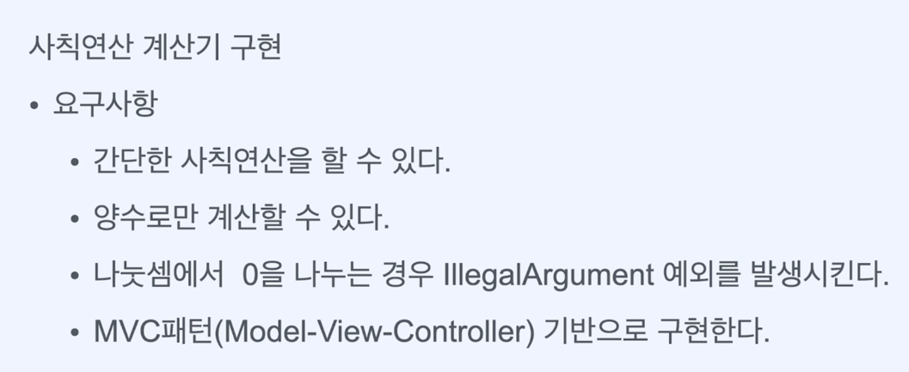
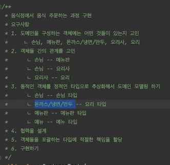
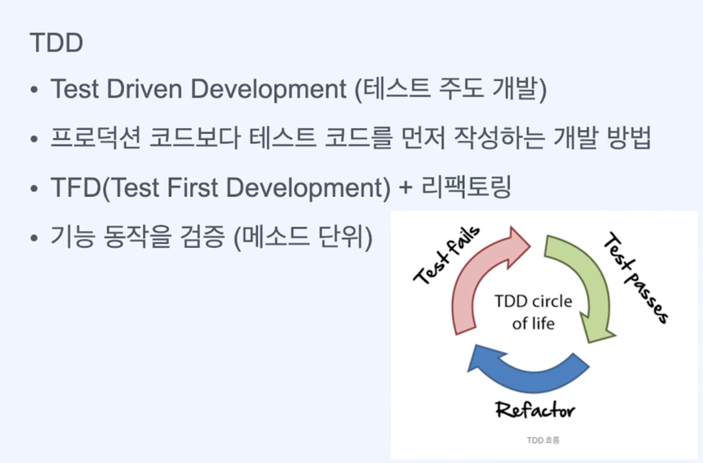
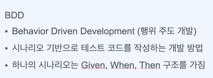
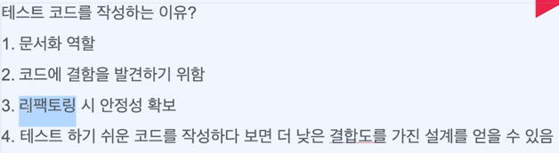

# 비밀번호 유효성 검증기
### 요구사항
- [ ] 비밀번호는 최소 8자 이상 12자 이하여야 한다.
- [ ] 비밀번호가 8자 미만 또는 12자 초과인 경우 IllegalArgumentException 예외를 발생시킨다.
- [ ] 경계조건에 대해 테스트 코드를 작성한다.

# 사칙연산 계산기 구현
요구사항 

# 학점 계산기 구현 
요구사항
- [ ] 평균학점 계싼 방법 = (학점수 * 교과목 평점)의 합계/수강신청 총학점 수
- [ ] 일급 컬렉션 사용

# 음식점에서 음식 주문하는 과정 구현

# 개발 방식

 